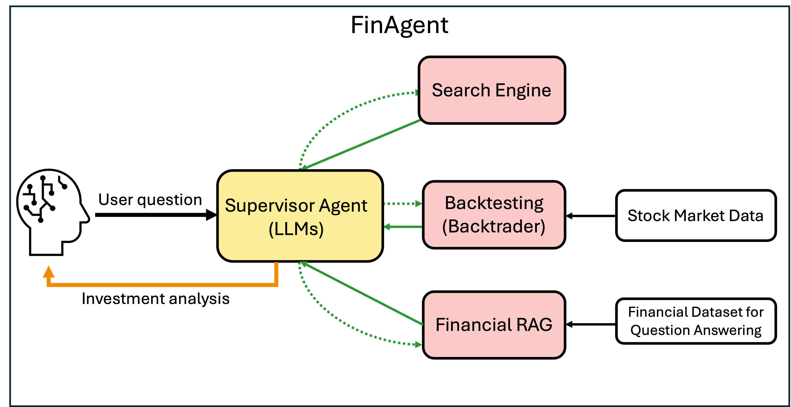

# FinAgent - Financial AI Agent

This repository is about developing a Financial AI Agent, combining financial data RAG, search engine, and Backtrader quantitative trading tools to generate investment analysis.




## Features
- **Vector Database (LlamaIndex & Faiss)**     
  Build a retrieval system for financial documents (e.g., earnings reports, analyst research, news). Currently experimenting with vector database construction using the FinDER dataset [1] to enable Retrieval-Augmented Generation (RAG) for financial QA.

- **Search Engine API Integration** **(FastAPI & SerpAPI)**         
  Get the latest market news.

- **Backtesting in Quantitative Trading (Backtrader)**        
  Download historical stock market data from both the Taiwan and U.S. markets for specified time ranges. It allows users to run trading strategies such as Simple Moving Average (SMA) cross and momentum-based approaches, enabling backtesting and performance evaluation on real market data.

- **LLM**        
  Integrate open-source models from HuggingFace, Google’s Gemini models, and OpenAI’s GPT series.

- **AI Agent (LangGraph)** **(WIP)**   
  Intergrate tools (RAG, search, backtester, LLM) to generate comprehensive investment advises.


## Usage

### Run with Docker Compose
```bash
docker compose up --build
```

### Install dependencies
```bash
pip install -r requirements.txt
```
### Build the vector database
```bash
cd ./agent
python build_index.py
```
This step will:
- Load the FinDER dataset
- Perform chunking and embeddings
- Build a Faiss vector database
- Persist the index to ../data/FinDER/

### Query the vector database
```bash
cd ./agent
python query_index.py
```
This step will:
- Load the persisted vector database
- Use a retriever to perform semantic search
- Return the most relevant answer snippets

### Download stock market data
```bash
cd ./agent
python download_stock_data.py
```

### Run FinAgent
```bash
cd ./agent
python run_react_agent.py
```

### Run tests
```bash
cd ./tests
pytest -q
```

## References
[1] Chanyel Choi, Jihoon Kwon, Jaeseon Ha, Hojun Choi, Chaewoon Kim, Yongjae Lee, Jy-yong Sohn, Alejandro Lopez-Lira.  
**FinDER: Financial Dataset for Question Answering and Evaluating Retrieval-Augmented Generation.**  
arXiv:2504.15800 (2025).  
[https://arxiv.org/abs/2504.15800](https://arxiv.org/abs/2504.15800)
